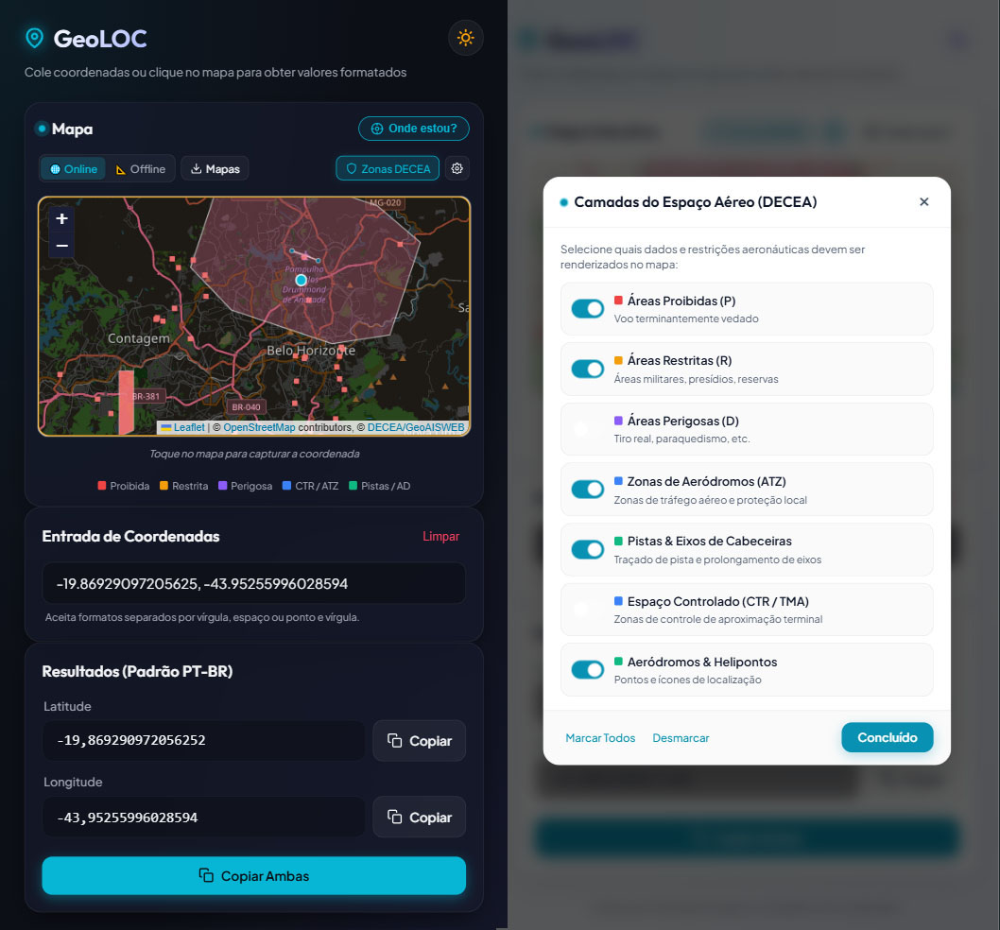

# 📍 GeoLOC

> Ferramenta web ágil e moderna para conversão, captura e formatação de coordenadas geográficas no padrão brasileiro (vírgula decimal), com foco em dispositivos móveis e integração cartográfica.



## 🚀 Sobre o Projeto

O **GeoLOC** foi desenvolvido para simplificar o trabalho de pilotos de drones, topógrafos, engenheiros e usuários de sistemas como o **SARPAS (DECEA)**, Google Earth e ferramentas GIS.

Frequentemente, coordenadas copiadas de mapas (como Google Maps ou GPS) vêm no formato internacional com ponto decimal e juntas em uma única linha:
`-20.464431484462686, -45.951409846570364`

Esta ferramenta separa automaticamente os valores em campos individuais de **Latitude** e **Longitude** e converte o ponto decimal (`.`) para a vírgula (`,'`), pronta para colagem em formulários técnicos brasileiros.

---

🔗 **Acesse online:** **[https://sandrobenigno.github.io/GeoLOC_Tool/](https://sandrobenigno.github.io/GeoLOC_Tool/)**

---

## ✨ Funcionalidades Principais

- 📱 **Interface Mobile-First**: Layout vertical e responsivo, botões grandes e fáceis de tocar no celular.
- 🗺️ **Mapa Interativo (OpenStreetMap)**: Toque ou clique em qualquer local do mapa para obter e converter as coordenadas instantaneamente, sem necessidade de chaves de API pagas.
- 🛡️ **Zonas de Restrição DECEA (GeoAISWEB)**: Camada oficial WMS com visualização de Áreas Proibidas (P), Restritas (R), Perigosas (D), Zonas de Aeródromo (ATZ), CTR/TMA, traçado de pistas de pouso, cones de cabeceiras e helipontos.
- ⚙️ **Painel de Configuração de Camadas**: Menu de ajustes (⚙️) para ligar/desligar individualmente cada tipo de restrição do espaço aéreo.
- 🎯 **Geolocalização ("Onde estou?")**: Localize sua posição GPS atual com um toque e preencha os campos automaticamente.
- 🌗 **Modo Claro / Modo Escuro**: Alternância dinâmica de temas (Sol/Lua) com ajuste de contraste do mapa em tempo real via filtros CSS.
- 📋 **Atalhos Rápidos de Cópia**: Botões dedicados para copiar Latitude, Longitude ou ambos com feedback visual instantâneo ("Copiado!").
- 🧠 **Parser Inteligente**: Aceita coordenadas coladas com vírgulas, espaços, ponto-e-vírgula, colchetes ou parênteses.
- 💾 **Preferências Salvas**: Lembra do seu tema preferido e da seleção de camadas do DECEA via `localStorage`.

---

## 🛠️ Tecnologias Utilizadas

- **HTML5** semântico
- **CSS3** moderno (CSS Variables, Flexbox, Glassmorphism, Micro-animações)
- **JavaScript (ES6+)** vanilla (sem frameworks pesados ou dependências externas)
- **Leaflet.js** (v1.9.4) & **OpenStreetMap**

---

## 📂 Estrutura do Projeto

```text
GeoLOC/
│
├── index.html      # Estrutura da interface web
├── style.css       # Estilização visual, temas (Dark/Light) e responsividade
├── app.js          # Lógica de conversão, mapa e clipboard
└── README.md       # Documentação do projeto
```

---

## 💻 Como Executar Localmente

Como o projeto é 100% estático (HTML/CSS/JS puros), basta abrir o arquivo `index.html` em qualquer navegador moderno.

Se preferir rodar através de um servidor local:

```bash
# Com Python 3
python -m http.server 8000

# Ou com Node.js / npx
npx serve .
```

Acesse em: `http://localhost:8000`

---

## 📄 Licença

Este projeto é distribuído sob a licença [MIT](https://opensource.org/licenses/MIT).
